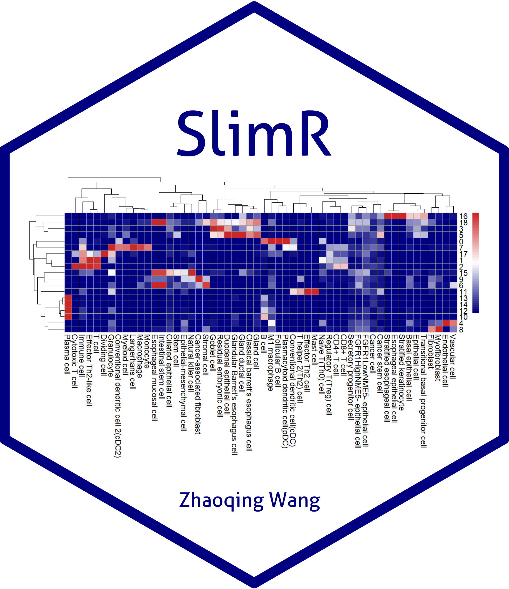

# SlimR: Marker-Based R Package for Single-Cell and Spatial-Transcriptomic Annotation

## Overview



SlimR is an R package designed for annotating single-cell and spatial-transcriptomics (ST) datasets. It supports the creation of a unified marker list, Markers_list, using sources including: the package's built-in curated species-specific cell type and marker reference databases (e.g., 'Cellmarker2', 'PanglaoDB'), Seurat objects containing cell label information, or user-provided Excel tables mapping cell types to markers.

Based on the Markers_list, 'SlimR' enables one-click generation of annotation heatmaps ('Annotation_heatmap') visualizing relationships between input cell types and reference marker lists. Additionally, it can iterate through different cell types to generate corresponding annotation reference plots (e.g., 'Markers_dotplot', 'Metric_heatmap', 'Mean_expression_box_plot').

## Table of Contents
1. [Preparation](#1-preparation)  
   - [1.1 Installation](#11-installation)  
   - [1.2 Loading SlimR](#12-loading-slimr)  
   - [1.3 Dependencies (if installation fails)](13-dependencies-if-installation-fails)  

2. [Standardized Marker_list Input](#2-standardized-marker_list-input)  
   - [2.1 From Preprocessed Cellmarker2 Database](#21-from-preprocessed-cellmarker2-database)  
   - [2.2 From Preprocessed PanglaoDB Database](#22-from-preprocessed-panglaodb-database)  
   - [2.3 From Seurat Objects](#23-from-seurat-objects)  
   - [2.4 From Excel Tables](#24-from-excel-tables)  
   - [2.5 From TCellSI](#25-from-tcellsi)  

3. [Automated Annotation Workflow](#3-automated-annotation-workflow)  
   - [3.1 Annotation Heatmap](#31-annotation-heatmap)  
   - [3.2 Annotation Dot Plot](#32-annotation-dot-plot) 
   - [3.3 Annotation Box Plot](#33-annotation-box-plot)  

4. [Semi-Automated Annotation Workflow](#4-semi-automated-annotation-workflow)  
   - [4.1 With Cellmarker2 Database](#41-with-cellmarker2-database)  
   - [4.2 With PanglaoDB Database](#42-with-panglaodb-database)  
   - [4.3 With Seurat-Based Marker Lists](#43-with-seurat-based-marker-lists)  
   - [4.4 With Excel-Based Marker Lists](#44-with-excel-based-marker-lists)  

5. [Conclusion](#5-conclusion)

---

## 1. Preparation
### 1.1 Installation
(Option One) Install SlimR directly from CRAN using: (Stable version)
```r
install.packages("SlimR")
```
*Note: Try adjusting the CRAN image to "Global (CDN)" if you encounter a version mismatch during installation.*

(Option Two) Install SlimR directly from GitHub using: (Development version, more recommended)
```r
devtools::install_github("Zhaoqing-wang/SlimR")
```

### 1.2 Loading SlimR
Load the package in your R environment:
```r
library(SlimR)
```

### 1.3 Dependencies (if installation fails)
SlimR requires R (≥ 3.5) and depends on the following packages: `cowplot`, `dplyr`, `ggplot2`, `patchwork`, `pheatmap`, `readxl`, `scales`, `Seurat`, `tidyr`, `tools`. Install missing dependencies using:
```r
# Install dependencies if needed:
install.packages(c("cowplot", "dplyr", "ggplot2", "patchwork", 
                   "pheatmap", "readxl", "scales", "Seurat", 
                   "tidyr", "tools"))
```

## 2. Standardized Marker_list Input
SlimR requires a standardized list format for storing marker information, metrics, and corresponding cell types (list names = cell types, first column = markers, subsequent columns = metrics).

### 2.1 From Preprocessed Cellmarker2 Database
Load the database:
```r
Cellmarker2 <- SlimR::Cellmarker2
```
Optional metadata exploration:
```r
Cellmarker2_table <- SlimR::Cellmarker2_table
View(Cellmarker2_table)
```
Generate marker list:
```r
Markers_list_Cellmarker2 <- Markers_filter_Cellmarker2(
  Cellmarker2,
  species = "Human",
  tissue_class = "Intestine",
  tissue_type = NULL,
  cancer_type = NULL,
  cell_type = NULL,
  cell_name = NULL,
  marker = NULL,
  counts = NULL
)
```
*Note: Output usable in sections 3.1, 3.2, 3.3 and 4.1.*

### 2.2 From Preprocessed PanglaoDB Database
Load the database:
```r
PanglaoDB <- SlimR::PanglaoDB
```
Optional metadata exploration:
```r
PanglaoDB_table <- SlimR::PanglaoDB_table
View(PanglaoDB_table)
```
Generate marker list:
```r
Markers_list_panglaoDB <- Markers_filter_PanglaoDB(
  PanglaoDB,
  species_input = 'Human',
  organ_input = 'GI tract'
)
```
*Note: Output usable in sections 3.1, 3.2, 3.3 and 4.2.*

### 2.3 From Seurat Objects
First identify cluster features:
```r
seurat_markers <- FindAllMarkers(
  sce.all, 
  group.by = "Cell_type", 
  only.pos = TRUE
)
```
Then generate marker list:
```r
Markers_list_Seurat <- read_seurat_markers(
  seurat_markers,
  sort_by = "avg_log2FC",
  gene_filter = 10
)
```
*Note: Output usable in sections 3.1, 3.2, 3.3 and 4.3.*

### 2.4 From Excel Tables
**Format Requirements**:  
- Each sheet name = cell type  
- First row = column headers  
- First column = markers  
- Subsequent columns = metrics  

```r
Markers_list_Excel <- read_excel_markers("D:/Laboratory/Marker_load.xlsx")
```
*Note: Output usable in sections 3.1, 3.2, 3.3 and 4.4.*

### 2.5 From TCellSI
TCellSI: A database of T cell markers. Reference: Yang et al. (2024) <doi:10.1002/imt2.231>
```r
Markers_list_TCellSI <- SlimR::Markers_list_TCellSI
```
*Note: Output usable in sections 3.1, 3.2, 3.3 and 4.4.*

## 3. Automated Annotation Workflow
### 3.1 Annotation Heatmap
Generate a heatmap to estimate the likelihood that various cell clusters exhibited similarity to control cell types:
```r
Celltype_annotation_Heatmap(
  seurat_obj = sce,
  gene_list = Markers_list,
  species = "Human",
  cluster_col = "seurat_cluster",
  min_expression = 0.1,
  specificity_weight = 3
)
```

### 3.2 Annotation Dot Plot
Generates per-cell-type expression dot plots:
```r
Celltype_annotation_Dotplot(
  seurat_obj = sce,
  gene_list = Markers_list,
  gene_list_type = "Cellmarker2",
  species = "Human",
  save_path = "./annotations/"
  )
```

### 3.3 Annotation Box Plot
Generates per-cell-type expression box plots:
```r
Celltype_annotation_Box(
  seurat_obj = sce,
  gene_list = Markers_list, 
  species = "Human",
  cluster_col = "seurat_cluster",
  assay = "RNA",
  save_path = "./SlimR/Celltype_annotation_Bar/"
)
```

## 4. Semi-Automated Annotation Workflow
### 4.1 With Cellmarker2 Database
```r
Celltype_annotation_Cellmarker2(
  seurat_obj = sce,
  gene_list = Markers_list_Cellmarker2,
  species = "Human",
  cluster_col = "seurat_cluster",
  assay = "RNA",
  save_path = "./SlimR/Celltype_annotation_Cellmarkers2.0/"
)
```

### 4.2 With PanglaoDB Database
```r
Celltype_annotation_PanglaoDB(
  seurat_obj = sce,
  gene_list = Markers_list_panglaoDB,
  species = "Human",
  cluster_col = "seurat_cluster",
  assay = "RNA",
  save_path = "./SlimR/Celltype_annotation_PanglaoDB/"
)
```

### 4.3 With Seurat-Based Marker Lists
```r
Celltype_annotation_Seurat(
  seurat_obj = sce,
  gene_list = Markers_list_Seurat,
  species = "Human",
  cluster_col = "seurat_cluster",
  assay = "RNA",
  save_path = "./SlimR/Celltype_annotation_Seurat/"
)
```

### 4.4 With Excel-Based Marker Lists
Generates integrated dot plots and metric heatmaps:
```r
Celltype_annotation_Excel(
  seurat_obj = sce,
  gene_list = Markers_list_Excel,
  species = "Human",
  cluster_col = "seurat_cluster",
  assay = "RNA",
  save_path = "./SlimR/Celltype_annotation_Excel/"
)
```
## 5. Conclusion
Thank you for using SlimR. For questions, issues, or suggestions, please contact:

**Zhaoqing Wang**  
📧 851091628@qq.com; zhaoqingwang@mail.sdu.edu.cn
